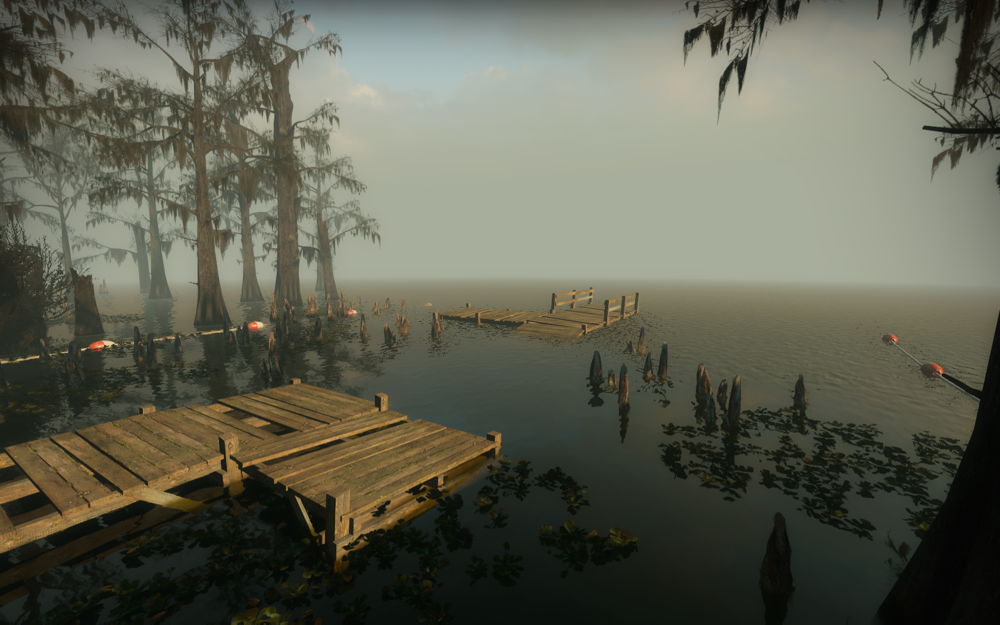
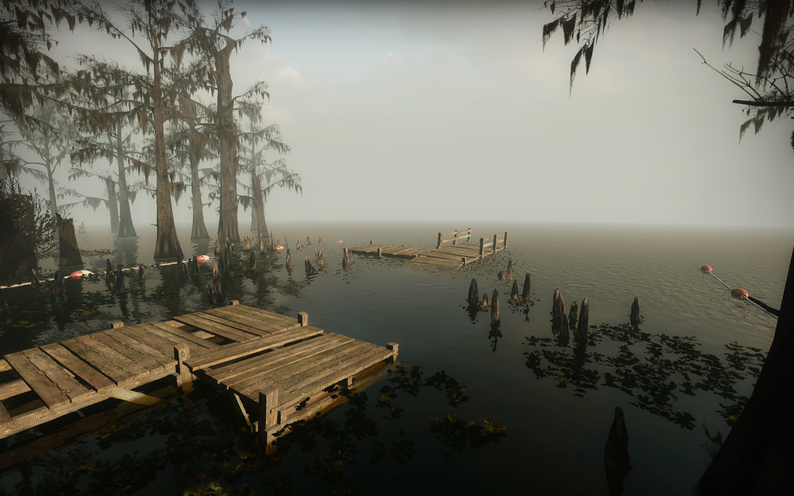
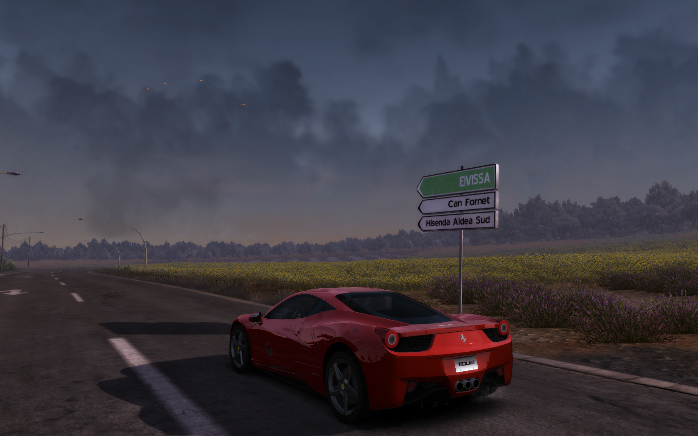
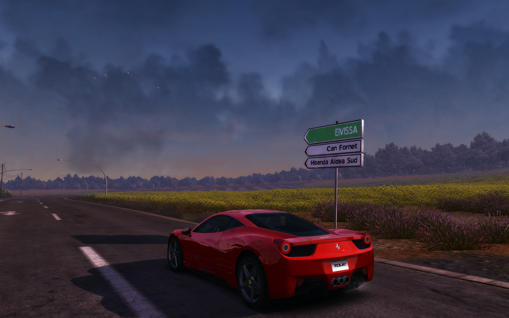

# my-sweetfx-presets-collection
presets de sweetfx/reshade criados por min para melhorar o visual de jogos que eu jogava.

Clique abaixo para ver todos os meus presets
link : https://sfx.thelazy.net/users/u/GianGabriel/

recomendo baixar a versão 1.5.1 do SweetFX deste site:

link : https://www.guru3d.com/download/sweetfx-shader-suite-download/

uma pequena amostra:

<a href="https://sfx.thelazy.net/games/preset/2625/">GG_Lighting_Enhancer L4D2 Preset:</a>

Antes:
 
Depois:
 

<a href="https://sfx.thelazy.net/games/preset/4030/">GG_Config V2.5 FINAL:</a>

Antes:
 
Depois:
 
